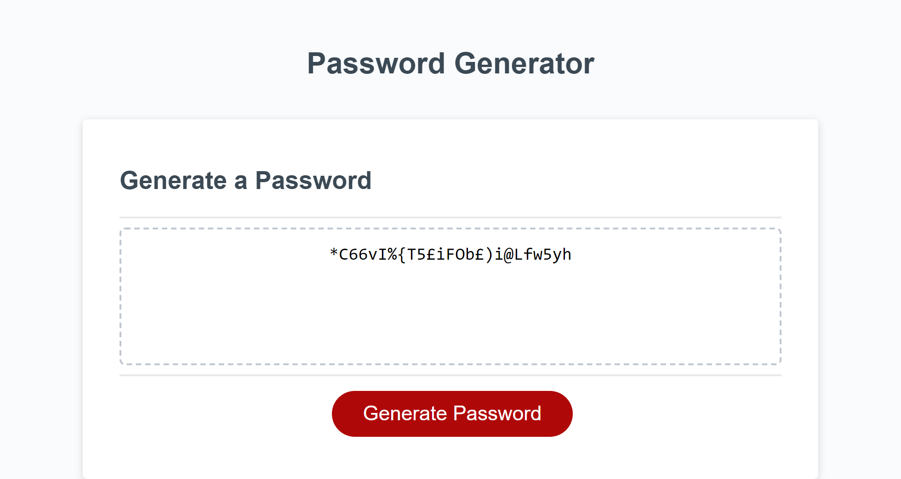

# Project Title: Random Password Generator

## Project Description:
This project was to present an application to generate a random password based on user-specified criteria. This app will run in a browser. I designed this using starter code (based on updated HTML, CSS) and added a JavaScript code. Its user interface is responsive and adapts to 500 and 690px screen sizes. 

## How to Install and Run the Project:
This project can be cloned from my repository via the github website by following the link:
https://github.com/veerak21/pwd-gen and can be cloned to your personal repo.

## How to Use the Project:
Using this project will give new developers an idea of powering starter codes with JavaScript codes for designing a random password generating application. This project presents an improved structure to the application.

## Credits:
Thanks to Xander Rapstine (https://github.com/Xandromus) for providing the rescources for this project.

## Website URL and imange:

https://veerak21.github.io/pwd-gen

Output screenshot

Output screenshot for 690px

Output screenshot for 690px

